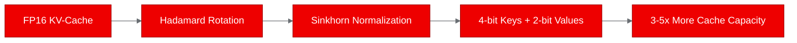
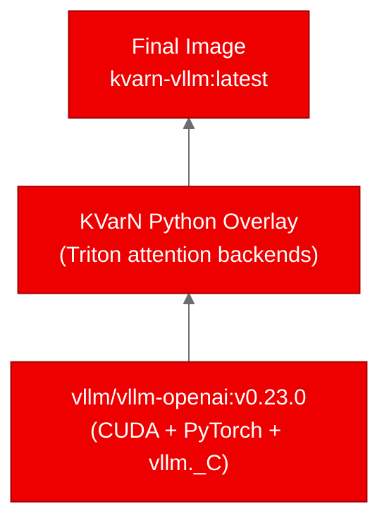

# Image Review: v1 -- KVarN Blog Draft

## Scores

| Dimension | Weight | Score (1-10) | Weighted |
|---|---|---|---|
| Placement rationale | 2x | 4 | 8 |
| Prompt specificity | 2x | 2 | 4 |
| Brand compliance | 2x | 7 | 14 |
| Aspect ratio & sizing | 1x | 5 | 5 |
| Alt text quality | 1x | 2 | 2 |
| Image count | 1x | 3 | 3 |
| **Total** | | | **36 / 90** |

**Overall Score: 4.0 / 10**

## Inventory of Visuals

| # | Type | Location (line) | Description |
|---|---|---|---|
| 1 | Mermaid diagram | 50-61 | Kubernetes resource topology: Namespace -> Deployment, Service, PVC -> API endpoints |

No image placeholders (`![...]`) are present in the draft.

## Per-Visual Feedback

### Mermaid Diagram: Deployment Topology (lines 50-61)

**Strengths:**
- Well-placed immediately after the deployment description, aiding comprehension of the Kubernetes resource relationships
- Correct diagram type (flowchart/`graph TD`) for showing resource hierarchy
- `%%{init}%%` theme block is present with Red Hat brand variables: `primaryColor: #EE0000`, `primaryBorderColor: #A30000`, `lineColor: #6A6E73`, `secondaryColor: #F0F0F0`, `tertiaryColor: #0066CC`
- Node labels include useful detail (GPU count, port, storage size)

**Issues:**
- Missing a caption or accessible description for the diagram. Readers using screen readers or text-only renderers will get no context.
- The arrow from `DEP --> SVC` creates a circular relationship (NS -> DEP, NS -> SVC, DEP -> SVC) that may confuse readers. The Service selects the Deployment's pods; consider clarifying directionality (e.g., `SVC -->|selects| DEP`).

## Missing Image Opportunities

The draft has significant visual gaps. The following locations would benefit from images or diagrams:

### 1. Hero Image (before or at the title)
- **What:** A hero banner establishing the topic visually -- e.g., a conceptual diagram showing KV-cache compression or a branded title card.
- **Suggested prompt:** "A 16:9 technical illustration showing GPU memory with KV-cache blocks being compressed from large FP16 blocks to small 4-bit/2-bit blocks, using Red Hat brand palette (#EE0000 accents, #151515 background, #F0F0F0 text). Clean, minimal, enterprise style. No text overlay."
- **Rationale:** Sets the visual tone and makes the post shareable on social media.

### 2. KV-Cache Quantization Concept Diagram (after line 8, "What is KVarN?" section)
- **What:** A Mermaid or image showing the quantization pipeline: FP16 KV-cache -> Hadamard rotation -> Sinkhorn normalization -> 4-bit keys / 2-bit values.
- **Suggested Mermaid:**

- **Rationale:** The core technical concept of the post. Currently explained only in prose; a visual pipeline would make it immediately clear.

### 3. File Overlay Strategy Diagram (in "The containerization challenge" section, around line 33)
- **What:** A diagram showing the layered container image: base vLLM image (with compiled CUDA extensions) + KVarN Python overlay on top.
- **Suggested Mermaid:**

- **Rationale:** The overlay strategy is a key lesson of the post. A layer diagram would make the "copy over site-packages" approach immediately intuitive.

### 4. Build Pipeline Flow (in "Building and deploying" section, around line 39)
- **What:** A diagram showing: Developer -> `oc start-build` -> OpenShift Build Pod -> Quay.io -> Deployment Pod (with GPU).
- **Rationale:** Readers unfamiliar with OpenShift Builds would benefit from seeing the end-to-end flow from source to running pod.

## Summary

The draft relies almost entirely on code blocks and prose to convey technical concepts. The single Mermaid diagram is well-executed and correctly branded, but the post needs at least 3-4 more visuals to meet the standard for a developer blog. The most critical gaps are:

1. **No hero image** -- the post will look plain in listings and social shares.
2. **No conceptual diagram for KV-cache quantization** -- the core technical value proposition is only described in text.
3. **No image placeholders with generation prompts** -- there are zero prompts to evaluate for specificity.
4. **No alt text on any visual** -- accessibility is not addressed.

### Critical Issues

- **Zero image placeholders**: The draft contains no `` images at all. A developer blog post of this length should have 3-5 visuals.
- **No alt text**: The Mermaid diagram lacks a caption or accessible alternative text.
- **Missing hero image**: Required for social media cards and blog listing pages.

### Recommendations (Priority Order)

1. Add a hero image placeholder (16:9) with a specific generation prompt referencing Red Hat brand colors
2. Add a Mermaid diagram for the KV-cache quantization pipeline in the "What is KVarN?" section
3. Add a Mermaid diagram for the container overlay strategy in the containerization section
4. Add captions/alt-text equivalents to all diagrams
5. Consider a build pipeline flow diagram for the OpenShift Builds section
