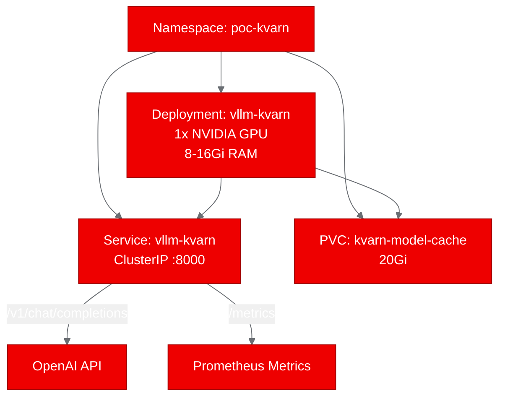

## Deploying KVarN: KV-Cache Quantization for vLLM on OpenShift AI

LLM inference at scale hits a hard ceiling: KV-cache memory. Every concurrent request and every additional token of context eats into the same GPU memory pool. KVarN, a vLLM fork from Huawei CSL, attacks this problem with variance-normalized KV-cache quantization. It delivers 3-5x more cache capacity and up to 1.3x better throughput, all without sacrificing accuracy. We deployed it on OpenShift to see if these gains hold up on enterprise infrastructure.

## What is KVarN?

KVarN (Variance-Normalized KV-Cache) is a native vLLM attention backend that quantizes the key-value cache from FP16 down to 4-bit keys and 2-bit values. It uses Hadamard rotation and iterative variance normalization (Sinkhorn) to distribute weight magnitudes evenly before quantization, which is why it maintains FP16-level accuracy where other methods degrade.

The practical appeal is the activation model: one CLI flag. You add `--kv-cache-dtype kvarn_k4v2_g128 --block-size 128` to your `vllm serve` command, and the Triton kernels compile at runtime. No model changes, no calibration dataset, no retraining.

```bash
vllm serve Qwen/Qwen2.5-1.5B \
  --dtype float16 \
  --kv-cache-dtype kvarn_k4v2_g128 \
  --block-size 128
```

## The containerization challenge

KVarN is a fork of vLLM v0.23.0, meaning it modifies ~22 files across the vLLM codebase. Building the entire vLLM from source on-cluster would take 30-60 minutes and require a full CUDA development toolkit. We needed a faster approach.

Our solution: use the official `vllm/vllm-openai:v0.23.0` Docker image as a base and overlay KVarN's modified Python files on top. This preserves all the precompiled CUDA extensions (`vllm._C`) while adding KVarN's Triton-based attention backends that JIT-compile at runtime.

```dockerfile
FROM vllm/vllm-openai:v0.23.0 AS base
USER root
WORKDIR /opt/kvarn
COPY . .

# Overlay KVarN onto installed vLLM
ENV VLLM_SITE=/usr/local/lib/python3.12/dist-packages/vllm
RUN cp -r /opt/kvarn/vllm/* "$VLLM_SITE/"
```

OpenShift assigns arbitrary UIDs to containers for security. The base vLLM image includes a non-root entrypoint script that handles this by injecting a synthetic passwd entry and setting writable HOME directories. We included this in our Dockerfile, which resolved the `getpwuid(): uid not found` crash that initially blocked deployment.

## Building and deploying on OpenShift

We built the image using OpenShift's binary build system. The build uploads source to the cluster, runs the Dockerfile, and pushes directly to Quay.io, no local container runtime needed.

```bash
oc start-build kvarn-vllm \
  --from-dir="./KVarN" \
  --follow --wait \
  -n autopoc-test-builds
```

The deployment manifest requests a single NVIDIA GPU with 8Gi RAM and mounts a 20Gi PVC for the HuggingFace model cache. The startup probe gives the server up to 10 minutes to download and load the model on first launch.



## Validating KVarN-optimized inference

We ran four test scenarios against the deployed OpenAI-compatible API:

| Test | Result | Duration |
|------|--------|----------|
| Health check (`/health`) | Pass | 0.02s |
| Model listing (`/v1/models`) | Pass | 0.01s |
| Chat completion (`/v1/chat/completions`) | Pass | 1.13s |
| Prometheus metrics (`/metrics`) | Pass | 0.04s |

The chat completion test sent a query about KV-cache quantization and received a coherent 64-token response in 1.1 seconds. The metrics endpoint exposed 420 Prometheus values, including KV-cache utilization metrics that confirm the quantized backend is active.

The critical validation: the server's startup log shows KVarN's configuration is correctly applied:

```
non-default args: {
  'model': 'Qwen/Qwen2.5-1.5B',
  'dtype': 'float16',
  'kv_cache_dtype': 'kvarn_k4v2_g128',
  'block_size': 128
}
```

## Lessons learned

**File overlay beats editable install for forks.** Our first approach (`pip install -e .`) uninstalled the base vLLM and tried to reinstall KVarN, but editable installs don't include precompiled C extensions. Copying Python files directly over the site-packages directory preserved the compiled `vllm._C` module.

**OpenShift UID handling needs explicit support.** OpenShift's restricted SCC assigns random UIDs not present in `/etc/passwd`. Python's `getpass.getuser()` calls `pwd.getpwuid()`, which raises `KeyError` for unknown UIDs. The vLLM project's own non-root entrypoint script handles this by appending a synthetic passwd entry and setting `$USER` and `$HOME`.

**OpenShift Builds handle large images well.** The final image is approximately 15GB (CUDA runtime plus PyTorch plus vLLM). OpenShift's binary build system pulled the base image, applied our overlay, and pushed to Quay.io without timeout issues.

## Next steps

The natural follow-up is a side-by-side throughput comparison: one pod running standard FP16 vLLM, another running KVarN, both serving the same model under identical load. The Prometheus `/metrics` endpoint already exposes the KV-cache utilization and throughput numbers needed for this comparison.

For production integration, KVarN can be packaged as a KServe custom runtime, enabling Red Hat OpenShift AI's auto-scaling and canary deployment features. The single-flag activation model maps cleanly to a KServe InferenceService configuration.

**Resources:**
- [KVarN repository](https://github.com/huawei-csl/KVarN)
- [PoC fork with deployment artifacts](https://github.com/aicatalyst-team/KVarN)
- [Container image on Quay.io](https://quay.io/repository/aicatalyst/kvarn-vllm)
