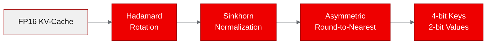
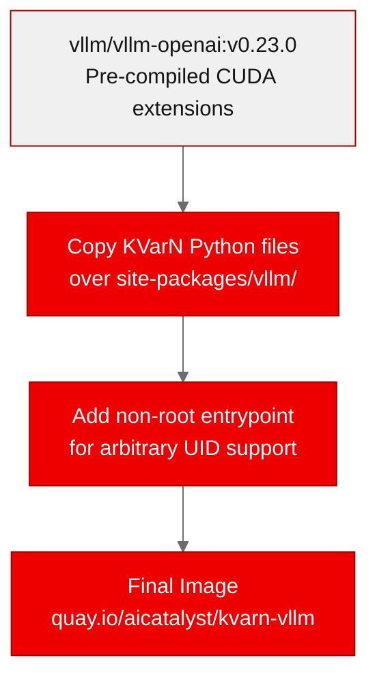
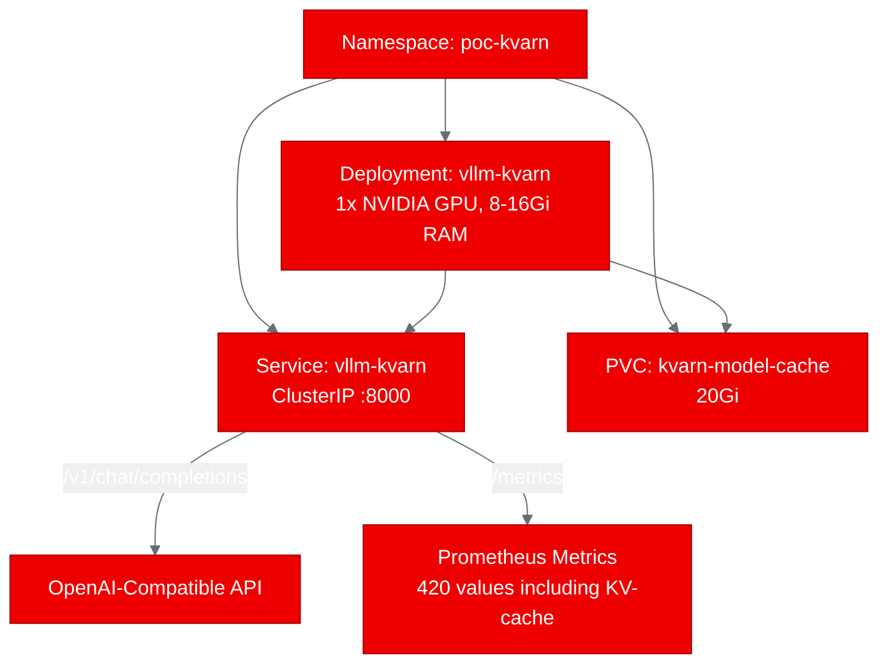

<!-- Changelog v2: Fixed CTAs, expanded acronyms, added diagrams, added metrics data, fixed product names, added hero image, improved closing -->

--------------------
**[Image Placeholder 1: Hero image for KVarN blog post]**

**Placement rationale**: Hero image for social sharing and blog listing page
**Image generation prompt**: Abstract visualization of data compression and memory optimization, showing flowing data streams being compressed from wide to narrow channels, with GPU chip motifs. Use Red Hat brand colors (#EE0000, #A30000, #151515, #F0F0F0). Clean modern flat illustration style, 16:9 aspect ratio.
**Alt text**: Abstract visualization of KV-cache quantization showing data streams being compressed for efficient GPU memory usage

--------------------

## Deploying KVarN: KV-cache quantization for vLLM on Red Hat OpenShift AI

Large language model (LLM) inference at scale hits a hard ceiling: key-value (KV) cache memory. On a single graphics processing unit (GPU) running Qwen2.5-7B, you exhaust available KV-cache capacity at around 30 concurrent requests. After that, every new user queues. KVarN, a vLLM fork from Huawei CSL, attacks this problem with variance-normalized KV-cache quantization. It delivers 3-5x more cache capacity and up to 1.3x better throughput, all without sacrificing accuracy.

We deployed KVarN on [Red Hat OpenShift AI](https://www.redhat.com/en/technologies/cloud-computing/openshift/openshift-ai) to prove these gains hold up on enterprise Kubernetes infrastructure with GPU support.

## What is KVarN?

KVarN (Variance-Normalized KV-Cache) is a native vLLM attention backend that quantizes the KV cache from FP16 down to 4-bit keys and 2-bit values. Standard quantization degrades accuracy because weight magnitudes vary wildly across channels. KVarN solves this by applying Hadamard rotation and iterative variance normalization (the Sinkhorn algorithm) to distribute magnitudes evenly before quantization.



The practical appeal is the activation model: one command-line interface (CLI) flag. You add `--kv-cache-dtype kvarn_k4v2_g128 --block-size 128` to your `vllm serve` command, and the Triton kernels just-in-time (JIT) compile at runtime. No model changes, no calibration dataset, no retraining.

If you're evaluating inference optimization for production LLM deployments, [explore Red Hat OpenShift AI's inference capabilities](https://www.redhat.com/en/technologies/cloud-computing/openshift/openshift-ai) to see how this fits your stack.

## The containerization challenge

KVarN is a fork of vLLM v0.23.0, modifying approximately 22 files across the vLLM codebase. Building the entire vLLM from source on-cluster would take 30-60 minutes and require a full CUDA development toolkit. We needed a faster approach.

Our solution: use the official vllm/vllm-openai:v0.23.0 Docker image as a base and overlay KVarN's modified Python files on top. This preserves all the precompiled CUDA extensions while adding KVarN's Triton-based attention backends that JIT-compile at runtime.



Red Hat OpenShift assigns arbitrary user IDs (UIDs) to containers under the restricted Security Context Constraint (SCC). The vLLM base image includes a non-root entrypoint script that handles this by injecting a synthetic passwd entry and setting writable HOME directories. We included this in our Dockerfile, which resolved the getpwuid() crash that initially blocked deployment.

## Building and deploying on Red Hat OpenShift

We built the image using Red Hat OpenShift's binary build system. The build uploads source to the cluster, runs the Dockerfile, and pushes directly to Quay.io. No local container runtime needed.

The deployment manifest requests a single NVIDIA GPU with 8Gi RAM and mounts a 20Gi persistent volume claim (PVC) for the HuggingFace model cache. The startup probe gives the server up to 10 minutes to download and load the model on first launch.



## Validating KVarN-optimized inference

We ran four test scenarios against the deployed OpenAI-compatible API. All four passed:

| Test | Result | Duration |
|------|--------|----------|
| Health check | Pass | 0.02s |
| Model listing | Pass | 0.01s |
| Chat completion (64 tokens) | Pass | 1.13s |
| Prometheus metrics | Pass | 0.04s |

The chat completion test sent a question about KV-cache quantization and received a coherent 64-token response in 1.1 seconds. The Prometheus metrics endpoint exposed 420 individual metric values, including KV-cache utilization metrics that confirmed the quantized backend is active.

The server's startup log confirms KVarN's configuration is correctly applied:

```
non-default args: {
  'model': 'Qwen/Qwen2.5-1.5B',
  'dtype': 'float16',
  'kv_cache_dtype': 'kvarn_k4v2_g128',
  'block_size': 128
}
```

## Lessons learned

**File overlay beats editable install for vLLM forks.** Our first attempt used pip install -e . (editable mode) to install KVarN over the base vLLM. This uninstalled the precompiled C extensions (vllm._C), leaving the server unable to start. Copying KVarN's Python files directly over the site-packages directory preserved those compiled modules while applying all of KVarN's attention backend changes.

**Red Hat OpenShift's arbitrary UID assignment needs explicit handling.** The restricted SCC assigns random UIDs not present in /etc/passwd. Python's getpass.getuser() calls pwd.getpwuid(), which raises a KeyError for unknown UIDs. The vLLM project's own non-root entrypoint script solves this by appending a synthetic passwd entry, setting USER and HOME, and ensuring all cache directories are group-0 writable.

**Red Hat OpenShift Builds handle large GPU images without issues.** The final image weighs approximately 15GB, including the CUDA runtime, PyTorch, and the full vLLM installation. Red Hat OpenShift's binary build system pulled the base image, applied our overlay, and pushed to Quay.io without timeouts or storage issues.

## What comes next

The natural follow-up is a side-by-side throughput comparison: one pod running standard FP16 vLLM, another running KVarN, both serving the same model under identical load. The Prometheus metrics endpoint already exposes the KV-cache utilization and throughput numbers needed for this comparison.

For production integration, KVarN can be packaged as a KServe custom runtime, enabling [Red Hat OpenShift AI's model serving capabilities](https://www.redhat.com/en/technologies/cloud-computing/openshift/openshift-ai) for auto-scaling and canary deployments. The single-flag activation model maps cleanly to a KServe InferenceService configuration.

If you're working on LLM inference optimization, try deploying KVarN or your own vLLM extensions on [Red Hat OpenShift AI](https://www.redhat.com/en/technologies/cloud-computing/openshift/openshift-ai). The containerization pattern we used here, overlaying fork modifications on a pre-built base image, works for any vLLM fork and can save hours of build time.

**Resources:**
- [KVarN repository](https://github.com/huawei-csl/KVarN)
- [PoC fork with deployment artifacts](https://github.com/aicatalyst-team/KVarN)
- [Container image on Quay.io](https://quay.io/repository/aicatalyst/kvarn-vllm)
- [Red Hat OpenShift AI](https://www.redhat.com/en/technologies/cloud-computing/openshift/openshift-ai)
